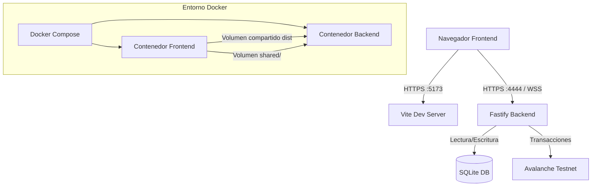

# 🏓 ft_transcendence — Pong Arena

Un juego de Pong multijugador moderno y en tiempo real, desarrollado como proyecto final del currículo de 42. Incluye torneos con brackets, integración con blockchain, autenticación avanzada y renderizado 3D en el navegador.

---

## 📋 Tabla de Contenidos

- [Descripción General](#descripción-general)
- [Arquitectura](#arquitectura)
- [Tecnologías](#tecnologías)
- [Estructura del Proyecto](#estructura-del-proyecto)
- [Características](#características)
- [Base de Datos](#base-de-datos)
- [API REST](#api-rest)
- [WebSockets](#websockets)
- [Blockchain](#blockchain)
- [Configuración y Variables de Entorno](#configuración-y-variables-de-entorno)
- [Instalación y Puesta en Marcha](#instalación-y-puesta-en-marcha)
- [Seguridad](#seguridad)
- [Internacionalización](#internacionalización)

---

## Descripción General

**ft_transcendence** es una Single-Page Application (SPA) de Pong multijugador con:

- Partidas en tiempo real entre jugadores humanos, IA y jugadores locales
- Sistema de torneos con brackets automáticos (hasta 8 jugadores)
- Resultados de torneos inmutables almacenados en la blockchain de Avalanche
- Autenticación completa con soporte para 2FA, Google OAuth y recuperación de contraseña por email
- Renderizado 3D con BabylonJS en el cliente
- Interfaz multilingüe (ES / EN / FR)

---

## Arquitectura



El sistema se compone de tres capas principales: [1](#0-0) 

- **Frontend** → Puerto `5173` (Vite + TypeScript + BabylonJS)
- **Backend** → Puerto `4444` (Fastify + Node.js)
- **Shared** → Código TypeScript compartido (tipos y mensajes de WebSocket)

---

## Tecnologías

### Backend [2](#0-1) 

| Tecnología | Uso |
|---|---|
| **Fastify** | Framework HTTP principal |
| `@fastify/websocket` | Comunicación en tiempo real |
| `@fastify/jwt` | Autenticación con tokens JWT |
| `@fastify/cookie` | Gestión de cookies HTTP-only |
| `@fastify/multipart` | Subida de archivos (avatares) |
| `sqlite` + `sqlite3` | Base de datos relacional |
| `bcrypt` | Hash seguro de contraseñas |
| `speakeasy` + `qrcode` | Autenticación de dos factores (TOTP) |
| `google-auth-library` | OAuth con Google |
| `nodemailer` | Envío de emails (OTP, 2FA) |
| `ethers` | Interacción con contrato en Avalanche |
| `@babylonjs/core` | Motor de física del juego (servidor) |
| `cannon-es` | Motor de física |

### Frontend

| Tecnología | Uso |
|---|---|
| **TypeScript** | Lenguaje principal |
| **Vite** | Bundler y servidor de desarrollo |
| **TailwindCSS** | Estilos utility-first |
| **BabylonJS** | Renderizado 3D del juego |
| Patrón MVVM propio | Gestión de estado (similar a Redux) |

---

## Estructura del Proyecto

```
42ft_transcendence/
├── docker-compose.yml
├── backend/
│   ├── package.json
│   └── src/
│       ├── index.js          # Entry point, arranque HTTPS
│       ├── app.js            # Registro de plugins y rutas
│       ├── mailer.js         # Emails transaccionales
│       ├── config/           # Configuración centralizada
│       ├── plugins/
│       │   ├── config.js     # Plugin de configuración
│       │   └── db.js         # Plugin SQLite + migraciones
│       ├── routes/api/
│       │   ├── auth.js       # /api/auth/*
│       │   ├── users.js      # /api/users/*
│       │   ├── profile.js    # /api/profile/*
│       │   └── tournaments.js# /api/tournaments/*
│       ├── game/
│       │   ├── Game/         # ServerGame, ServerGameSocket, ServerPongTable
│       │   ├── Player/       # AIPlayer, ServerSocketPlayer
│       │   ├── PowerUps/     # 6 power-ups + efectos
│       │   └── Maps.js       # Definición de mapas
│       ├── websocket/
│       │   ├── index.js      # WebSocket de juego
│       │   ├── online-websocket.js
│       │   ├── waitroom-websocket.js
│       │   ├── tournament-websocket.js
│       │   ├── tournament-brackets.js
│       │   ├── game-manager.js
│       │   ├── virtual-players.js
│       │   └── event-bus.js
│       └── services/
│           ├── blockchain.js # Interacción con Avalanche
│           ├── Blockchain.sol# Smart contract Solidity
│           └── room-service.js
├── frontend/
│   ├── vite.config.ts
│   ├── tailwind.config.js
│   └── src/
│       ├── main.ts           # Entry point
│       ├── navigation.ts     # Router SPA basado en hash
│       ├── components/       # Header, Footer, Traducciones
│       ├── screens/          # Pantallas de la aplicación
│       │   └── Game/         # ClientGame, ClientGameSocket, Mapas, PowerUps
│       ├── services/         # API client, WebSockets, Tournament state
│       ├── redux/            # AppStore, HistoryStore, reducers
│       └── mvvm/             # Patrón MVVM
└── shared/
    ├── types/
    │   └── messages.ts       # Tipos compartidos de mensajes WS
    └── utils/
```

---

## Características

### 🎮 Modos de Juego

El juego soporta múltiples tipos de jugadores en la misma partida: [3](#0-2) 

- **Jugadores remotos**: humanos conectados desde distintos navegadores
- **Jugadores IA**: bots controlados por el servidor
- **Jugadores locales**: múltiples personas en el mismo dispositivo

### 🗺️ Mapas Disponibles [4](#0-3) 

| Mapa | Descripción |
|---|---|
| `BaseMap` | Mapa clásico 30×50 sin obstáculos |
| `ObstacleMap` | Con un obstáculo central destructible (5 vidas) |
| `MultiplayerMap` | Mapa 50×50 para hasta 4 jugadores con paredes diagonales |
| `TestMap` | Mapa de pruebas con pared adicional |

### ⚡ Power-Ups [5](#0-4) 

| Power-Up | Efecto |
|---|---|
| `MoreLength` | Alarga tu pala |
| `LessLength` | Encoge la pala del rival |
| `CreateBall` | Añade una bola extra al juego |
| `Shield` | Activa un escudo protector |
| `SpeedDown` | Ralentiza la bola rival |
| `SpeedUp` | Acelera la bola |

### 🏆 Torneos

- Hasta **8 jugadores** por torneo
- Brackets generados automáticamente
- Configuración personalizable: mapa, power-ups, viento, puntos para ganar, límite de tiempo
- Soporte de jugadores IA en el bracket
- Resultados finales almacenados en blockchain de Avalanche (inmutables) [6](#0-5) 

### 💨 Mecánica de Viento

El servidor emite eventos `WindChanged` que afectan a la trayectoria de la bola, añadiendo un elemento dinámico a las partidas. [7](#0-6) 

---

## Base de Datos

SQLite. Las tablas se crean automáticamente al arrancar: [8](#0-7) 

| Tabla | Propósito |
|---|---|
| `users` | Usuarios registrados con estadísticas |
| `games` | Historial de partidas |
| `tournaments` | Torneos (bracket JSON incluido) |
| `tournament_players` | Jugadores por torneo |
| `tournament_onchain_matches` | Hash de transacciones de blockchain |
| `refresh_tokens` | Tokens de refresco JWT |
| `two_factor_backup_codes` | Códigos de emergencia 2FA |
| `friends` | Relaciones de amistad |
| `rooms` | Salas de espera |
| `room_players` | Jugadores en salas |
| `user_settings` | Configuración guardada del usuario |
| `password_resets` | OTPs de restablecimiento de contraseña |
| `login_challenges` | Challenges para 2FA en login |

La ruta del archivo de base de datos es `./db/pong.db` (montado como volumen Docker). [9](#0-8) 

---

## API REST

Todas las rutas comienzan con `/api/`.

### Autenticación — `/api/auth` [10](#0-9) 

| Método | Endpoint | Descripción |
|---|---|---|
| `POST` | `/api/auth/register` | Registro (firstName, lastName, username, email, password) |
| `POST` | `/api/auth/login` | Login con username o email |
| `POST` | `/api/auth/login/2fa` | Completar login con código TOTP o backup code |
| `POST` | `/api/auth/logout` | Cierra sesión y revoca refresh token |
| `POST` | `/api/auth/refresh` | Renueva el access token |
| `GET` | `/api/auth/verify` | Verifica si el token actual es válido |
| `POST` | `/api/auth/google` | Login/registro con Google OAuth |
| `POST` | `/api/auth/2fa/setup` | Inicia la configuración de 2FA |
| `POST` | `/api/auth/2fa/verify` | Activa 2FA tras verificar código TOTP |
| `POST` | `/api/auth/2fa/disable` | Desactiva 2FA |
| `POST` | `/api/auth/password/request-reset` | Solicita OTP de restablecimiento por email |
| `POST` | `/api/auth/password/reset-otp` | Resetea contraseña con OTP |
| `POST` | `/api/auth/password/reset-backup` | Resetea contraseña con backup code |

### Torneos — `/api/tournaments` [11](#0-10) 

| Método | Endpoint | Descripción |
|---|---|---|
| `POST` | `/api/tournaments` | Crear nuevo torneo |
| `GET` | `/api/tournaments` | Listar torneos disponibles |
| `GET` | `/api/tournaments/:id` | Detalle de un torneo |
| `GET` | `/api/tournament/status` | Estado actual del torneo del usuario |
| `GET` | `/api/tournament/avalanche/:id` | Datos del torneo en blockchain |
| `GET` | `/api/tournaments/history` | Historial de torneos finalizados |

### Usuarios — `/api/users`

| Método | Endpoint | Descripción |
|---|---|---|
| `GET` | `/api/users/room-config` | Obtener configuración de sala guardada |
| `POST` | `/api/users/room-config` | Guardar configuración de sala |

---

## WebSockets

El backend expone 4 canales WebSocket distintos: [12](#0-11) 

| Canal | Propósito |
|---|---|
| **Game WS** | Comunicación en tiempo real del juego (física, power-ups, puntos) |
| **Online WS** | Presencia online de usuarios |
| **Waitroom WS** | Sala de espera para partidas normales |
| **Tournament WS** | Coordinación de brackets y partidas de torneo |

### Tipos de mensajes del juego [13](#0-12) 

Los mensajes más relevantes:

- `GameInit` / `GameStart` / `GameEnded` / `GameDispose` — Ciclo de vida
- `AddPlayer` — Añadir jugador con posición y color
- `BallMove` / `PaddlePosition` — Sincronización de física
- `PointMade` / `ScoreMessage` — Marcador
- `CreatePowerUp` / `PlayerUsePowerUp` / `InventoryChanged` — Sistema de power-ups
- `WindChanged` — Cambio de dirección del viento
- `GameCountdown` / `MatchTimerTick` / `MatchSuddenDeath` — Timers

### Mensajes de Sala de Espera [14](#0-13) 

---

## Blockchain

Los resultados de torneos se almacenan de forma **inmutable** en la red de prueba de Avalanche (Fuji Testnet). [15](#0-14) 

### Smart Contract (`TournamentStorage`) [16](#0-15) 

**Funciones del contrato:**

| Función | Descripción |
|---|---|
| `storeMatch(...)` | Almacena el resultado de un partido |
| `storeFinalBracket(...)` | Almacena el bracket final del torneo en JSON |
| `getMatchCount(id)` | Número de partidos de un torneo |
| `getMatchInfo(id, index)` | Datos de un partido concreto |
| `getFinalBracket(id)` | Recupera el bracket final |

El backend utiliza `ethers.js` para interactuar con el contrato y guarda los `txhash` en la base de datos para consulta posterior. [17](#0-16) 

---

## Configuración y Variables de Entorno

### Backend (`backend/.env`) [18](#0-17) 

| Variable | Descripción | Por defecto |
|---|---|---|
| `JWT_SECRET` | **Requerido.** Clave secreta para firmar JWTs | — |
| `PORT` | Puerto del servidor | `4444` |
| `HOST` | Host de escucha | `0.0.0.0` |
| `NODE_ENV` | Entorno (`development`/`production`) | `development` |
| `FRONTEND_URL` | URL del frontend para CORS | — |
| `BCRYPT_ROUNDS` | Rondas de bcrypt | `10` |
| `LOG_LEVEL` | Nivel de log de Pino | `info` |
| `SSL_KEY` | Ruta a la clave privada SSL | `certs/localhost.key` |
| `SSL_CERT` | Ruta al certificado SSL | `certs/localhost.crt` |
| `GOOGLE_AUTH_CLIENT` | Client ID de Google OAuth | — |
| `MAIL_GMAIL_USER` | Email de Gmail para envío | — |
| `MAIL_GMAIL_APP_PASSWORD` | App Password de Gmail | — |
| `MAIL_FROM_NAME` | Nombre del remitente | `Pong Arena` |
| `MAIL_FROM_EMAIL` | Email del remitente | `no-reply@example.test` |
| `WALLET_PRIVATE_KEY` | Clave privada del wallet Ethereum | — |
| `CONTRACT_ADDRESS` | Dirección del contrato en Avalanche | — |

### Frontend (`frontend/.env.production`)

| Variable | Descripción |
|---|---|
| `VITE_API_URL` | URL base del backend |

---

## Instalación y Puesta en Marcha

### Requisitos previos

- **Docker** y **Docker Compose**
- Certificados SSL en `backend/certs/` y `frontend/certs/` (pueden ser autofirmados para desarrollo)

### Pasos

```bash
# 1. Clona el repositorio
git clone https://github.com/gabrielofl/42ft_transcendence.git
cd 42ft_transcendence

# 2. Crea los archivos de entorno
cp backend/.env.example backend/.env
cp frontend/.env.example frontend/.env.production

# 3. Rellena las variables requeridas en backend/.env
#    (JWT_SECRET es OBLIGATORIO)

# 4. Genera certificados SSL para desarrollo local
mkdir -p backend/certs frontend/certs
openssl req -x509 -nodes -days 365 -newkey rsa:2048 \
  -keyout backend/certs/localhost.key \
  -out backend/certs/localhost.crt \
  -subj "/CN=localhost"
cp backend/certs/* frontend/certs/

# 5. Levanta los contenedores
docker compose up --build
```

El frontend estará disponible en **`https://localhost:5173`**.
El backend en **`https://localhost:4444`**. [1](#0-0) 

### Scripts de desarrollo (backend) [19](#0-18) 

```bash
npm start          # Producción
npm run dev        # Nodemon (recarga automática)
npm run dev:pretty # Nodemon con pino-pretty (logs formateados)
```

---

## Seguridad

El sistema implementa múltiples capas de seguridad: [20](#0-19) 

- **HTTPS** en todos los entornos (certificados SSL obligatorios)
- **JWT** con expiración de **3 horas** (access token) y **7 días** (refresh token)
- **Cookies HTTP-only** — los tokens no son accesibles desde JavaScript
- **CSRF Token** — cookie no-httpOnly para protección contra CSRF
- **bcrypt** con 10 rondas para el hash de contraseñas
- **2FA TOTP** con soporte de aplicaciones autenticadoras (Google Authenticator, etc.)
- **10 códigos de backup** generados al activar 2FA
- **Revocación de tokens** al hacer logout o resetear contraseña
- **Google OAuth** con verificación de `idToken` en el servidor

---

## Navegación (Frontend SPA) [21](#0-20) 

La aplicación es una SPA que navega usando URL hash (`#screen`). Las pantallas disponibles son:

| Hash | Pantalla |
|---|---|
| `#login` | Registro / Login / Google OAuth |
| `#home` | Pantalla principal |
| `#create` | Selección de mapa y configuración |
| `#waiting` | Sala de espera (partida normal) |
| `#join` | Unirse a una partida existente |
| `#tournament-selection` | Seleccionar/crear torneo |
| `#tournament-lobby` | Lobby del torneo |
| `#tournament-waiting` | Sala de espera del torneo |
| `#game` | Partida en curso (BabylonJS) |
| `#profile` | Perfil, historial, amigos, estadísticas |
| `#leaderboard` | Clasificación general y blockchain |

---

## Emails Transaccionales [22](#0-21) 

El sistema envía emails automáticos en estos eventos:

| Evento | Email |
|---|---|
| Solicitud de reset de contraseña | OTP de 6 dígitos con expiración de 15 minutos |
| Reset exitoso con backup code | Notificación de seguridad |
| Activación de 2FA | Confirmación + lista de 10 backup codes |

---

## Internacionalización [23](#0-22) 

La interfaz soporta **3 idiomas**:
- 🇪🇸 **Español** (`es`)
- 🇬🇧 **Inglés** (`en`)
- 🇫🇷 **Francés** (`fr`)

El idioma se gestiona a través del `langueReducer` en el store global de la aplicación.

---

## Notes

- **`JWT_SECRET`** es la única variable de entorno estrictamente obligatoria para arrancar el backend; sin ella el servidor lanza un error fatal. [24](#0-23) 
- El volumen compartido `frontend-dist` permite que el backend sirva los archivos estáticos del frontend compilado en producción. [25](#0-24) 
- El `shared/` directorio está montado como volumen en **ambos contenedores**, garantizando que los tipos TypeScript son idénticos en cliente y servidor. [26](#0-25) 
- El contrato Solidity está desplegado en **Avalanche Fuji Testnet** (`https://api.avax-test.network/ext/bc/C/rpc`). Los resultados on-chain son **permanentes e inmutables**. [27](#0-26) 
- La lógica de juego (física, colisiones) se ejecuta **en el servidor** con BabylonJS y Cannon-ES, y el cliente solo renderiza el estado recibido por WebSocket. Esto previene cheating. [28](#0-27)
